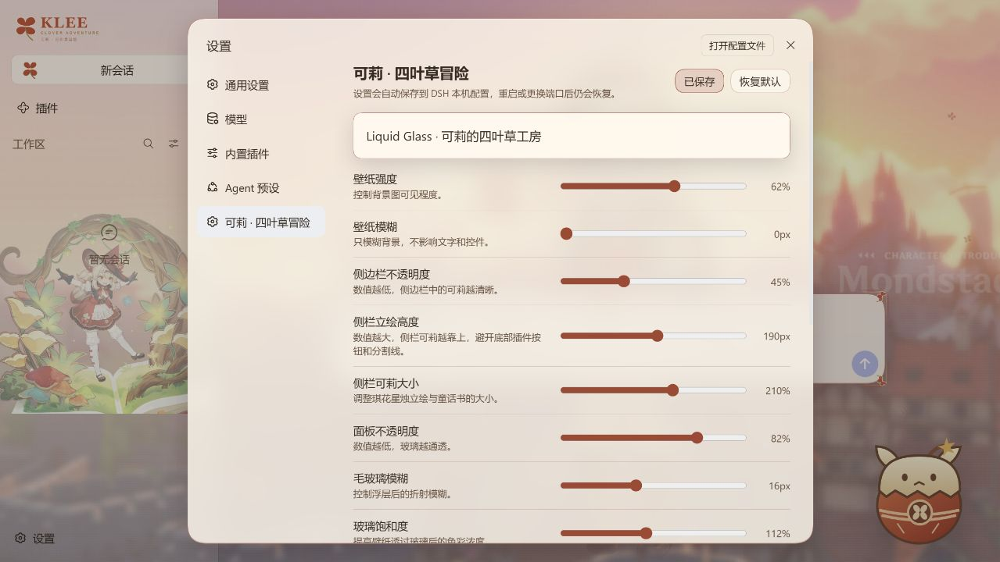

# 桌面版 / Official Desktop

适配官方 DeepSeek Harness Desktop 的共享 Web 客户端；`dsh.client.platform` 保留 `web`，这是渲染器平台而不是安装 profile。官方桌面版使用 `desktop` profile 和 `dsh-app://app/` 协议。

## Windows 安装

1. 下载本仓库最新 Release ZIP，解压到长期保留的目录。
2. 桌面版至少打开过一次，随后从系统托盘菜单 **退出**。关闭窗口可能仅隐藏，不等于退出。
3. 在插件目录运行；把 `-DesktopPath` 改为实际应用安装目录：

```powershell
powershell -NoProfile -ExecutionPolicy Bypass -File .\install.ps1 -Profile desktop -DesktopPath 'D:\deepseek_harness'
```

如应用使用自定义 `DSH_HOME`，在同一终端设置相同值后安装。脚本不会猜测、更改或迁移数据目录。

也可以指定桌面版自带命令：

```powershell
.\install.ps1 -Profile desktop -DshCommand 'D:\deepseek_harness\resources\runtime\cli\bin\dsh.cmd'
```

脚本使用桌面版内置 pnpm 安装 `file:` 包及依赖，不需要系统 Node.js/npm；不使用 npm 版 `npx dsh` 操作 `desktop`。插件由 Desktop 管理，不会安装到 `web` profile。重启应用，在「设置 → 可莉 · 四叶草冒险」调整并保存。

## 覆盖更新 / 卸载

退出桌面应用，把新版 ZIP 覆盖到相同源码目录，**重新运行上面的 desktop 安装命令**以刷新已安装的 `file:` 包，再重启。仅替换源码目录不保证已安装副本更新。

```powershell
.\uninstall.ps1 -Profile desktop -DesktopPath 'D:\deepseek_harness'
```

卸载保留 `$DSH_HOME/klee-clover-theme.json`。相同 DSH_HOME 的 Web/Desktop 共用外观设置；不同 DSH_HOME 不自动迁移。停用其他全局主题（包括 Doro、dream-skin），每次只启用一个。

## macOS

通过应用菜单 **Manage dsh Command…** 安装桌面版自带命令，打开应用初始化 profile 后完全退出。在插件目录运行：

```sh
dsh plugin --profile desktop add "file:$PWD"
```

确保命令属于 Desktop 的安装 runtime，不是另一份 npm dsh。更新时重复安装命令；卸载用 `dsh plugin --profile desktop remove dsh-klee-clover-theme`。

## 适配内容与验证边界

- Windows 标题栏保持不透明底色，内容框架与侧栏父容器不遮挡壁纸，保留原生窗口按钮/拖动规则。
- 人物高度和背景动画避开 Windows 标题栏 / macOS 顶部控制带；全屏时恢复完整区域。
- 使用相对路径加载图片与设置 API；不硬编码端口，不关闭 Origin/CSRF 检查。Desktop 自己验证 `dsh-app://app` 并转发到认证 Host。
- 独立主题设置入口、玻璃参数、角色图层和磁盘保存继续复用。
- 在 Windows 官方 Desktop 0.2.0-rc.2 的内置 CLI/pnpm 下验证隔离 profile 安装，并启动官方 Desktop Host，检查模块加载、独立设置入口和保存。自动测试覆盖资源、设置读写与拒绝外部 Origin。原生 Electron 窗口与 macOS/Linux 窗口未做完整端到端实测。



参考：[官方桌面版文档](https://github.com/deepseek-ai/deepseek-harness/blob/master/apps/desktop/README.md)。

## English quick start

Launch Desktop once, then **fully quit from the tray/menu**. Extract the release and run `install.ps1 -Profile desktop -DesktopPath '<application install directory>'`. The script uses bundled pnpm and a `file:` package, never an npm/npx fallback. Keep the same DSH_HOME as the app. On updates, replace the source files **and rerun the installer** before reopening Desktop. Remove with the same flags on `uninstall.ps1`; saved preferences remain. Only one global theme should be enabled. Windows caption/content layout is adapted; native macOS/Linux window behavior is not locally verified.
