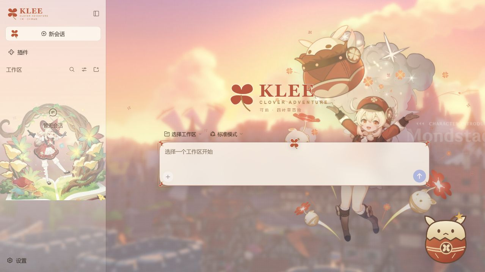
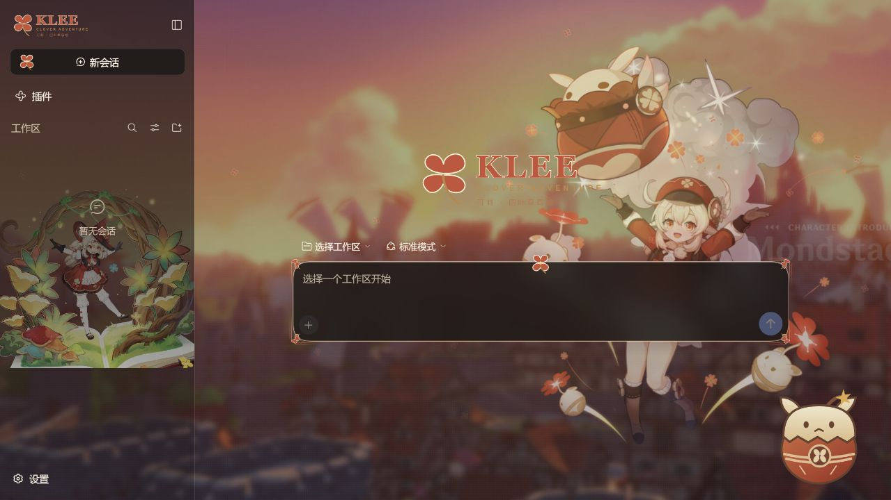
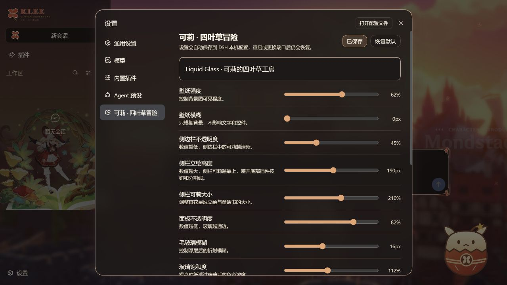

# 可莉 · 四叶草冒险

**Klee Clover Adventure — DeepSeek Harness 主题插件**

[English](README.en.md) · [下载安装包](https://github.com/QLruil419/dsh-klee-clover-theme/releases/latest) · [更新日志](CHANGELOG.md) · [素材来源与版权](ASSET_NOTICE.md)

**v1.1.0 支持官方 Desktop。** 详见 [桌面安装与覆盖更新](DESKTOP.md)。

蒙德的夕阳、可莉的红色外套、琪花星烛的童话书，以及一颗安静待在角落的蹦蹦炸弹。以朱红、奶油白和暖金统一界面，支持明暗外观与可调节的玻璃效果。

基于 [Doro Paradise v1.4.0](https://github.com/QLruil419/dsh-doro-paradise-theme/tree/v1.4.0) 的插件架构重新制作。独立包名、接口、样式命名空间和设置文件，保留原作代码的 MIT 版权声明。

> 非官方粉丝主题，与 HoYoverse、米哈游和 DeepSeek 无关联。代码采用 MIT；原神场景与角色图像不属于 MIT 授权范围，详见 [素材说明](ASSET_NOTICE.md)。



以上及下方截图取自隔离的 Harness 0.2.0-rc.2 实例；没有配置模型密钥，输入框因此显示选择工作区。

## 这一版有什么

- **真实原神场景**：背景使用米哈游官网托管的蒙德城夕照图，保留原图的柔焦效果；深色模式以暖棕底色压暗同一场景，不冒称游戏夜景。
- **两套不同造型**：主壁纸为经典红衣可莉的单人自然站姿同人立绘，使用 AI 生成，平衡头身比与五官并匹配蒙德夕阳；侧栏为原作「琪花星烛」服装立绘与童话书。主壁纸人物默认居中，没有跳跃、爆炸或悬浮道具，两者独立缩放。
- **独立设置页**：设置 → **可莉 · 四叶草冒险**，与通用设置、模型并列。
- **玻璃调节**：面板不透明度、背景模糊、毛玻璃模糊、饱和度、液态玻璃高光。
- **角色调节**：侧栏遮罩、立绘大小与离底高度；中央可莉强度、大小与水平位置；右侧蹦蹦炸弹大小和强度。
- **持续保存**：拖动后自动保存；另有「保存设置」按钮。DSH 重启、浏览器刷新、本地端口变化都能恢复。
- **轻量装饰**：四叶草图标、品牌字标、输入框边角和可关闭的四叶草动画；尊重系统的减少动态效果偏好。
- 所有素材随包附带，正常使用时无需连接图片 CDN。

<details>
<summary>深色主题与独立设置页</summary>




</details>

## 安装前

需要可运行的 DeepSeek Harness 与 Node.js/npm。主题代码要求 Node.js 20+；Harness 自身的 Node.js 要求以其发行版本为准。

**先确认 profile：** 浏览器版通常是 `web`，桌面版通常是 `desktop`。安装到错误 profile 会导致设置入口不出现。使用自定义数据目录时，安装命令与启动 Harness 必须指向同一个 `DSH_HOME`。

停用 Doro Paradise、dsh-dream-skin 等其他全局皮肤后再启用本主题。两个全局主题同时改写背景和颜色会互相覆盖；停用 Doro 不会删除其独立配置。

## Windows：ZIP 安装

1. 从 [Release](https://github.com/QLruil419/dsh-klee-clover-theme/releases/latest) 下载 `dsh-klee-clover-theme-v1.1.0.zip`。
2. 解压到长期保留的目录，例如 `D:\Plugins`。ZIP 内有顶层文件夹 `dsh-klee-clover-theme`。
3. 在 PowerShell 中执行以下命令。

浏览器版：

```powershell
Set-Location 'D:\Plugins\dsh-klee-clover-theme'
powershell -NoProfile -ExecutionPolicy Bypass -File .\install.ps1 -Profile web
```

桌面版：

```powershell
Set-Location 'D:\Plugins\dsh-klee-clover-theme'
powershell -NoProfile -ExecutionPolicy Bypass -File .\install.ps1 -Profile desktop -DesktopPath 'D:\deepseek_harness'
```

桌面版先打开一次初始化 profile，再从托盘菜单完全退出。`-DesktopPath` 改为实际应用目录；桌面安装不需要系统 npm。执行策略仅作用于这次脚本进程。

如果桌面版的 `dsh` 没加入 PATH，可传入安装目录内的命令文件，例如：

```powershell
# 将此路径改成你的实际 Harness 安装位置。
$dsh = 'D:\deepseek_harness\resources\runtime\cli\bin\dsh.cmd'
powershell -NoProfile -ExecutionPolicy Bypass -File .\install.ps1 -Profile desktop -DshCommand $dsh
```

如使用自定义 `DSH_HOME`，先在同一个 PowerShell 终端设置它，再运行安装命令。不要为了安装主题随意改成另一个目录。

4. 完全退出并重新启动 Harness。浏览器版可在页面按 `Ctrl + F5`。
5. 打开设置 → **可莉 · 四叶草冒险**。调整参数，点击「保存设置」，应显示「已保存」。

安装脚本检查每一步的退出码。Web 采用本地链接；Desktop 使用内置 pnpm 安装 `file:` 包及依赖。Desktop 覆盖源码后需重新运行安装脚本，再重启。

## 手动安装 / macOS / Linux

```sh
git clone https://github.com/QLruil419/dsh-klee-clover-theme.git
cd dsh-klee-clover-theme
npm install --omit=dev
dsh plugin --profile web add -w .
```

桌面版请使用 [DESKTOP.md](DESKTOP.md) 的内置命令与 `file:` 包流程，不使用 npm 版 dsh 操作 desktop。浏览器版没有 `dsh` 命令时可使用：

```sh
npx --yes @deepseek-ai/dsh@latest plugin --profile web add -w .
```

有桌面版自带命令时，优先使用同版本命令，避免混用不同 pnpm/Harness 版本。

## 设置如何保存

| 控制项 | 范围 | 默认值 |
| --- | --- | --- |
| 壁纸强度 / 模糊 | 0–100% / 0–32 px | 62% / 0 px |
| 侧边栏不透明度 | 18–100% | 45% |
| 侧栏立绘离底高度 / 大小 | 48–320 px / 100–280% | 190 px / 210% |
| 面板不透明度 | 28–100% | 82% |
| 玻璃模糊 / 饱和度 | 0–40 px / 80–150% | 16 px / 112% |
| 中央可莉强度 / 大小 | 0–100% / 42–110 vh | 62% / 96 vh |
| 可莉水平位置（主壁纸区域） | 35–85% | 50%，中央 |
| 蹦蹦炸弹大小 / 强度 | 96–480 px / 0–100% | 156 px / 92% |
| 液态高光 / 四叶草动画 | 开 / 关 | 开 / 开 |

`vh` 表示相对于窗口高度的比例。侧栏大小包含原始立绘的透明留白，故默认超过 100%。将角色或角落装饰强度设为 0 即可隐藏。

水平位置以侧边栏右侧的主壁纸区域为基准；50% 为中央。收起侧栏或调整窗口尺寸时，角色跟随该区域定位。1.0.3 首次读取旧版配置时会将旧位置迁移到中央并自动保存，只迁移一次，其他外观参数继续保留；之后可重新拖动位置滑块并保存。

主配置保存在 **`$DSH_HOME/klee-clover-theme.json`**。未设置 `DSH_HOME` 时使用用户主目录下的 `.dsh/klee-clover-theme.json`。同一 DSH_HOME 内的各 profile 共用这份主题外观；不同 DSH_HOME 各自保存。

拖动后约 250 ms 自动提交；手动保存可立即提交。网络请求按顺序写入，避免快速拖动时旧值覆盖新值。配置以临时文件写入再重命名，写入失败不会先清空旧文件。

浏览器缓存用于首屏和服务不可用时的回退。首次使用时，若磁盘尚无配置，会从浏览器当前设置初始化。显示「仅浏览器已保存」表示磁盘保存失败：请确认主机插件已启用、数据目录可写，刷新后再点保存。

**液态玻璃**在这里指 CSS 模糊、饱和度和高光描边的视觉效果，不是物理光线追踪。

## 更新与卸载

ZIP 用户：退出 Harness，将新版 ZIP 解压覆盖**同一个插件目录**。Web 用户运行 `npm install --omit=dev`；Desktop 用户重新运行 `.\install.ps1 -Profile desktop -DesktopPath '<应用目录>'`，再重启。DSH_HOME 中的数据文件不会被覆盖安装清空。

Git 用户：

```sh
git pull --ff-only
npm install --omit=dev
```

然后重启 Harness。卸载：

```powershell
.\uninstall.ps1 -Profile web
# 桌面版：.\uninstall.ps1 -Profile desktop -DesktopPath 'D:\deepseek_harness'
```

或 `dsh plugin --profile web remove -w dsh-klee-clover-theme`。卸载保留配置文件，便于重装恢复；不希望保留时可手动删除该单个 JSON 文件。

## 常见问题

**看不到设置入口 / Failed to load plugins**：确认插件加到当前 profile；主机与浏览器部分必须一起加载。不要把 `client.js` 单独注入网页。客户端模块 ID 固定为 `dsh-klee-clover-theme`，已适配 Harness 模块注册方式。

**侧栏人物被底部按钮挡住**：增大「侧栏立绘高度」，必要时减小「侧栏可莉大小」。侧栏和工作区的第三方布局插件可能改变结构，欢迎附截图提交 Issue。

**角色太抢眼或文字不清晰**：降低角色/壁纸强度，或提高面板不透明度；可把可莉水平位置移向右侧。

**背景天生模糊**：本版采用官网原图，原图即为柔焦蒙德夕照；将壁纸模糊设为 0 只能取消额外模糊，不能恢复原图没有的细节。

**锁文件或 pnpm 构建批准报错**：这是 Harness profile 依赖层的问题。使用同一套 Harness 自带 pnpm/CLI 处理；若提示批准构建，只批准你信任且确需的依赖。不要直接删除整个 profile、会话目录或全局锁文件。

**远程部署无法保存**：设置接口沿用主机信任域约束，远程访问需在 Harness 配置可信域名。不要用关闭鉴权来解决；本主题不提供用户级配置隔离，不建议在互不信任的共享实例上使用。

## 开发与验证

```sh
npm ci
npm run check
npm test
npm run preview
```

预览地址为 `http://127.0.0.1:4173`，使用真实主题脚本、React 设置组件和保存接口；模拟外壳仅用于视觉开发，不执行对话。预览配置隔离在 `.preview-state/`，不读取实际用户 DSH 配置。

自动测试覆盖：跨主机重启与端口变化恢复、保存值校验、跨站请求拒绝、超大请求拒绝、全部资源接口和非法资源名。

已在 **DeepSeek Harness 0.2.0-rc.2** 的独立 Web profile 中验证加载、独立设置页和真实保存；也检查了明暗与窄屏预览。Harness 插件 API 仍会演进，其他版本与第三方全局皮肤组合不作兼容性保证。

目录说明：`client.js` 为客户端主题与设置，`theme-route.js` 为资源及配置接口，`cordis.patch.yml` 为插件挂载声明，`scripts/` 为预览工具，`tests/` 为验证代码。
